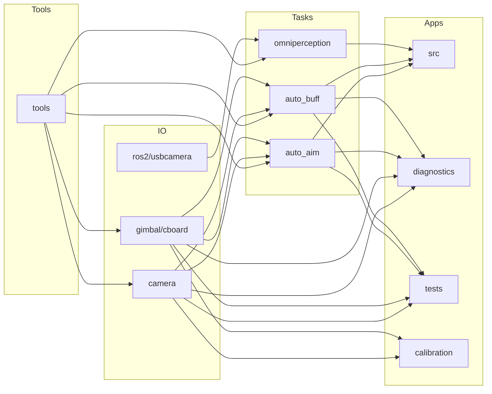

# Mermaid 01: 系统总览

```mermaid
flowchart LR
    subgraph Tools
        T1[tools]
    end

    subgraph IO
        I1[camera]
        I2[gimbal/cboard]
        I3[ros2/usbcamera]
    end

    subgraph Tasks
        A1[auto_aim]
        A2[auto_buff]
        A3[omniperception]
    end

    subgraph Apps
        S1[src]
        S2[diagnostics]
        S3[tests]
        S4[calibration]
    end

    T1 --> I1
    T1 --> I2
    T1 --> A1
    T1 --> A2
    T1 --> A3

    I1 --> A1
    I1 --> A2
    I2 --> A1
    I2 --> A2
    I3 --> A3

    A1 --> S1
    A2 --> S1
    A3 --> S1
    I1 --> S2
    I2 --> S2
    A1 --> S2
    A2 --> S2
    I1 --> S3
    I2 --> S3
    A1 --> S3
    A2 --> S3
    I1 --> S4
    I2 --> S4
```

