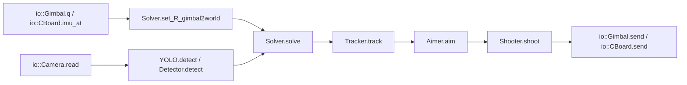

# Mermaid 02: 自瞄主链路

```mermaid
flowchart LR
    Cam[io::Camera.read]
    Pose[io::Gimbal.q / io::CBoard.imu_at]
    SolveR[Solver.set_R_gimbal2world]
    Detect[YOLO.detect / Detector.detect]
    Solve[Solver.solve]
    Track[Tracker.track]
    Aim[Aimer.aim]
    Shoot[Shooter.shoot]
    Send[io::Gimbal.send / io::CBoard.send]

    Cam --> Detect
    Pose --> SolveR
    SolveR --> Solve
    Detect --> Solve
    Solve --> Track
    Track --> Aim
    Aim --> Shoot
    Shoot --> Send
```

