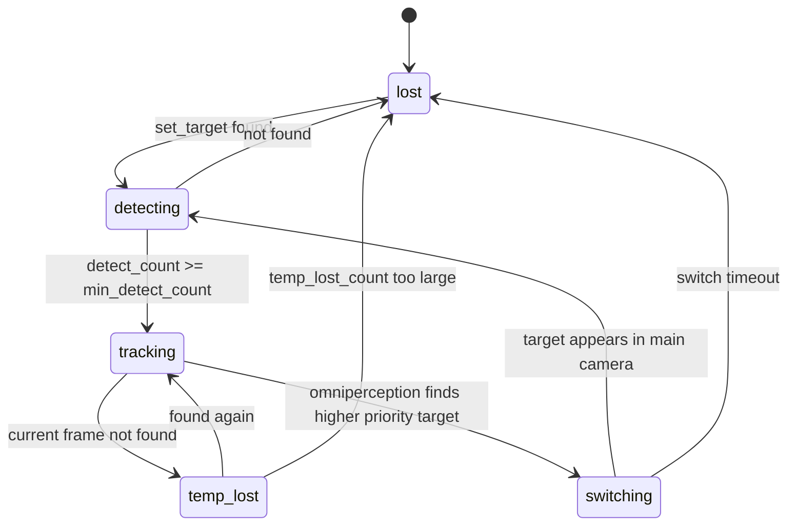

# Mermaid 03: Tracker 状态机

```mermaid
stateDiagram-v2
    [*] --> lost

    lost --> detecting: set_target found
    detecting --> tracking: detect_count >= min_detect_count
    detecting --> lost: not found

    tracking --> temp_lost: current frame not found
    temp_lost --> tracking: found again
    temp_lost --> lost: temp_lost_count too large

    tracking --> switching: omniperception finds higher priority target
    switching --> detecting: target appears in main camera
    switching --> lost: switch timeout
```

