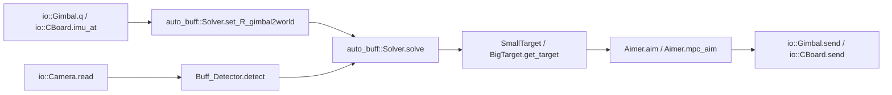

# Mermaid 04: 打符主链路

```mermaid
flowchart LR
    Cam[io::Camera.read]
    Pose[io::Gimbal.q / io::CBoard.imu_at]
    Detect[Buff_Detector.detect]
    SolveR[auto_buff::Solver.set_R_gimbal2world]
    Solve[auto_buff::Solver.solve]
    Target[SmallTarget / BigTarget.get_target]
    Aim[Aimer.aim / Aimer.mpc_aim]
    Send[io::Gimbal.send / io::CBoard.send]

    Cam --> Detect
    Pose --> SolveR
    SolveR --> Solve
    Detect --> Solve
    Solve --> Target
    Target --> Aim
    Aim --> Send
```

