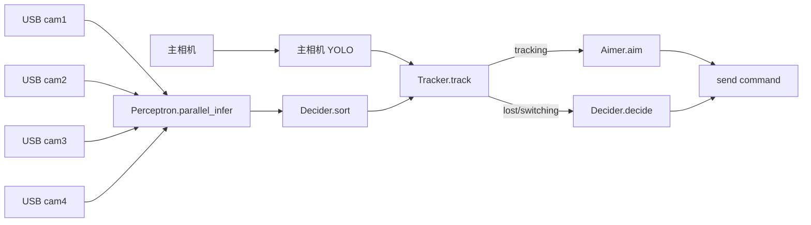

# Mermaid 05: 哨兵与全向感知链路

```mermaid
flowchart LR
    MainCam[主相机]
    Usb1[USB cam1]
    Usb2[USB cam2]
    Usb3[USB cam3]
    Usb4[USB cam4]
    MainYOLO[主相机 YOLO]
    Perceptron[Perceptron.parallel_infer]
    Sort[Decider.sort]
    Tracker[Tracker.track]
    Decide[Decider.decide]
    Aimer[Aimer.aim]
    Send[send command]

    MainCam --> MainYOLO --> Tracker
    Usb1 --> Perceptron
    Usb2 --> Perceptron
    Usb3 --> Perceptron
    Usb4 --> Perceptron
    Perceptron --> Sort --> Tracker

    Tracker -->|tracking| Aimer --> Send
    Tracker -->|lost/switching| Decide --> Send
```

