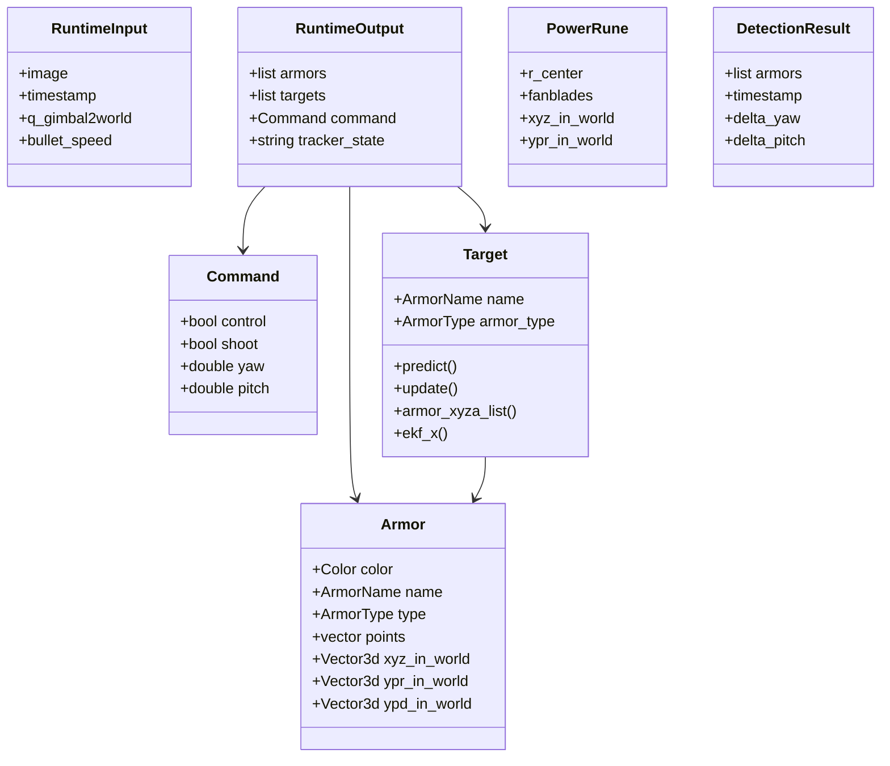

# Mermaid 06: 核心数据结构关系

```mermaid
classDiagram
    class Command {
      +bool control
      +bool shoot
      +double yaw
      +double pitch
    }

    class Armor {
      +Color color
      +ArmorName name
      +ArmorType type
      +vector points
      +Vector3d xyz_in_world
      +Vector3d ypr_in_world
      +Vector3d ypd_in_world
    }

    class Target {
      +ArmorName name
      +ArmorType armor_type
      +predict()
      +update()
      +armor_xyza_list()
      +ekf_x()
    }

    class RuntimeInput {
      +image
      +timestamp
      +q_gimbal2world
      +bullet_speed
    }

    class RuntimeOutput {
      +list armors
      +list targets
      +Command command
      +string tracker_state
    }

    class PowerRune {
      +r_center
      +fanblades
      +xyz_in_world
      +ypr_in_world
    }

    class DetectionResult {
      +list armors
      +timestamp
      +delta_yaw
      +delta_pitch
    }

    RuntimeOutput --> Command
    RuntimeOutput --> Armor
    RuntimeOutput --> Target
    Target --> Armor
```

